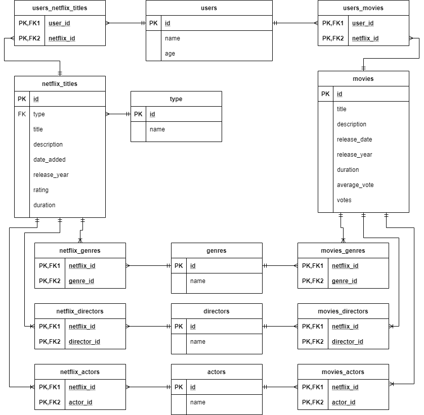

# Intro to Rails Project:

## My Movies webpage

## Rails Intro Project ToDo

### 1.1. [x]	Describe Datasets

- Netflix Titles
    - Link: https://www.kaggle.com/shivamb/netflix-shows 
    - Netflix programs and movies data
- IMDB Movies
    - Link: https://www.kaggle.com/stefanoleone992/imdb-extensive-dataset
    - IMDB Movies data
    - Can be linked together with netflix movies to get some data for directors, production company and/or actors
- Users Data
    - Use Faker to create fake users data, and setup users watched movies and programs.
- Description:
    - First I will use Netflix Titles dataset. From that, I will use the columns [**type**] [**title**] [**director**] [**cast**] [**date_added**] [**release_year**] [**rating**] [**duration**] [**listed_in**] [**description**]
    - Second data set is IMDB Movies. from that I will use the columns [**title**] [**year**] [**date_published**] [**genre**] [**duration**] [**director**] [**actors**] [**description**] [**avg_vote**] [**votes**]
    - The third data set will be a list of users created with Faker. It will have [**name**] [**age**] [**watched_movies**] [**watched_netflix**]
    - The database tables will be
        - [**NetflixTitles**] This will be defined with the Netflix Titles dataset. There will be a [**genre**] column extracted from [**listed_in**] dataset column. [**genre**] [**director**] and [**actor**] will be a many to many relationship.
        - [**Type**] This is the type of title from netflix (example "Movie", "Show"). It has a one to many relationship with [**NetflixTitles**] one title can have only one type, but a type can have many titles.
        - [**Movies**] This will be defined with the IMDB Movies dataset. [**genre**] [**director**] and [**actor**] will be a many to many relationship.
        - [**Genre**] This will be populated from both datasets, and have a many to many relationship to both [**NetflixTitles**] and [**Movies**]
        - [**Directors**] This will be populated from both datasets, and have a many to many relationship to both [**NetflixTitles**] and [**Movies**]
        - [**Actors**] This will be populated from both datasets, and have a many to many relationship to both [**NetflixTitles**] and [**Movies**]
        - [**Users**] This will be populated using faker to create a list of users, each with their own list of [**watched_movies**] [**watched_netflix**]. Those will be a many to many relationship to their respective tables.

### 1.2. [x]	Database ERD

<div style="display: block; text-align: center; margin: 1rem;">
    
</div>

### 1.3. [x]	4+ AR Models

- Commands used to generate the Models:
    - rails g model Type name:string
    - rails g model Genre name:string
    - rails g model Director name:string
    - rails g model Actor name:string
    - rails g model User name:string age:string
    - rails g model NetflixTitle title:string description:text date_added:date release_year:integer rating:string duration:string type:references
    - rails g model Movie title:string description:text release_date:date release_year:integer duration:integer average_vote:float votes:integer
- Relationship Models
    - rails g model UserNetflixTitle user:references netflix_title:references
    - rails g model UserMovie user:references movie:references
    - rails g model NetflixTitleGenre netflix_title:references genre:references
    - rails g model NetflixTitleActor netflix_title:references actor:references
    - rails g model NetflixTitleDirector netflix_title:references director:references
    - rails g model MovieGenre movie:references genre:references
    - rails g model MovieActor movie:references actor:references
    - rails g model MovieDirector movie:references director:references

### 1.4. [x]	One to Many

- There is a One to Many relationship from Type model to NetflixMovies model.

### 1.5. [x]	Many to Many

- There are Many to Many relationships from the following Models:
    - User
    - Genre
    - Director
    - Actor
- To both main models:
    - NetflixTitle
    - Movie
- Join tables:
    - UserNetflixTitle
    - UserMovie
    - NetflixTitleGenre
    - NetflixTitleActor
    - NetflixTitleDirector
    - MovieGenre
    - MovieActor
    - MovieDirector

### 1.6. [x]	Validations

- Added validation to all Models.
    - presense: true => when necessary
    - numericality: { only_integer: true } => For integer only values

### 1.7. [x]	3+ Data Sources

- seed.rb was updated to pull data from 3 data sources.
    - File: `IMDb movies.csv`
    - File: `netflix_titles.csv`
    - Faker to create users data
- Database tables were populated from data extracted from those files

Output from `rails db:seed`
```Created 2 Types
Created 58 Genres
Created 654 Directors
Created 2243 Actors
Created 20 Users
Created 538 Netflix Titles
Created 373 Movies
```

### 2.1. []	About Page

### 2.2. []	Menu

### 3.1. []	Collection Navigation

### 3.2. []	Member Pages

### 3.3. []	Multi-model Data on Member Pages

### 3.4. []	Hierarchical Collection Navigation

### 3.5. []	Pagination

### 3.6. []	Mapping

### 4.1. []	Simple Search

### 4.2. []	Hierarchical Search

### 5.1. []	Valid HTML

### 5.2. []	ERB Conditional

### 5.3. []	Bootstrap Grid

### 6.1. []	Git and Github

### 6.2. []	20 Commits

--- 

## Brainstorming about the project

### Possibility 1:

- Stackoverflow Questions
    - programming language categories

- Trending youtube videos
    - for each stackoverflow category, show the amount of stackoverflow questions and amount of trending youtube videos

### Possibility 2:

- Netflix Titles
    - Link: https://www.kaggle.com/shivamb/netflix-shows 
    - Netflix programs data

- IMDB Movies
    - Link: https://www.kaggle.com/stefanoleone992/imdb-extensive-dataset
    - Movies data
    - Can be linked together with netflix movies to get some data for directors, production company and/or actors

- Users Data
    - Use Faker to create fake users data, and setup users watched movies and programs.

